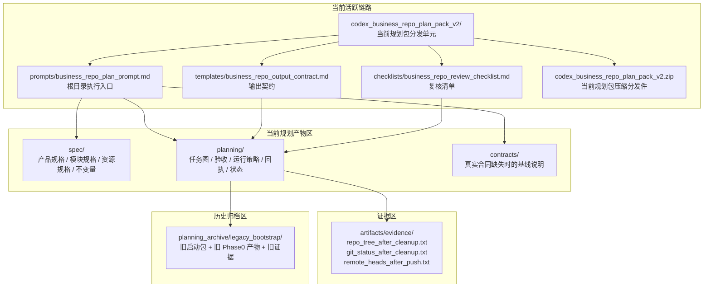
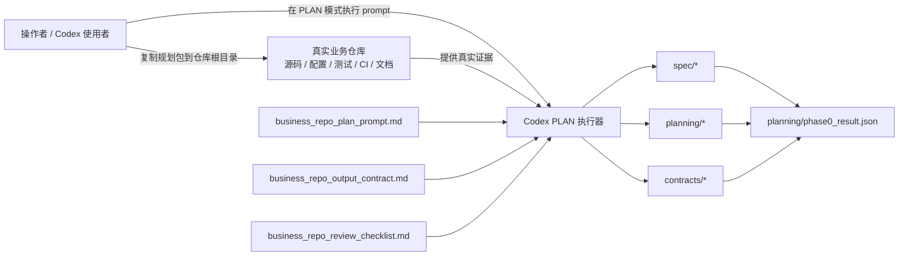
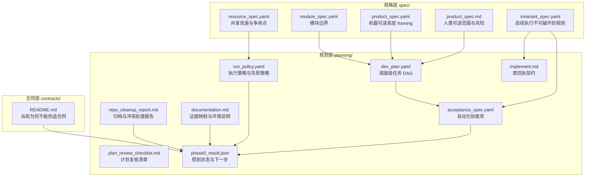
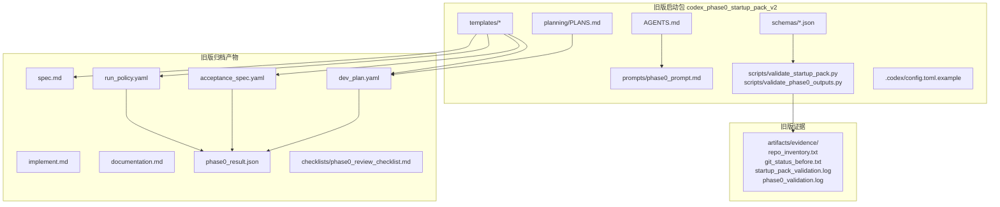
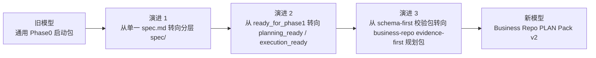

# JSJY Architecture

## 总览

这个仓库的架构不是传统“应用架构”，而是一个**规划资产架构**。它围绕三条主线组织：

1. **当前活跃规划链路**
2. **当前已生成规划产物链路**
3. **历史归档与审计链路**

理解这个仓库的关键，不是去找业务服务，而是区分：

- 哪些文件是当前入口
- 哪些文件是当前产物
- 哪些文件只是历史参考

## 1. 当前信息架构图

### 解读

- `codex_business_repo_plan_pack_v2/` 是当前规划包的完整分发形态
- 根目录 `prompts/`、`templates/`、`checklists/` 是当前执行入口镜像
- `spec/`、`planning/`、`contracts/` 是基于当前仓库证据产出的**结果层**
- `artifacts/evidence/` 不是业务日志，而是**规划/清理/远端状态证据层**
- `planning_archive/legacy_bootstrap/` 不是当前执行必读路径，而是**历史保留层**

## 2. 当前执行流架构图

### 执行语义

这条链路的关键约束是：

- Prompt 决定**工作顺序和硬约束**
- Output contract 决定**输出字段和机器可消费边界**
- Checklist 决定**人工复核视角**
- 真实业务仓证据决定**能说什么、不能说什么**
- `phase0_result.json` 决定**是否真正具备后续执行条件**

也就是说，这个仓库的“运行时”本质上是一种**文档驱动的规划执行流**，不是服务进程。

## 3. 当前产物内部结构图

### 分层关系

这一层的设计重点是“先规格，后计划，再状态声明”：

- `spec/` 定义边界、资源、风险、不变量
- `planning/` 把规格转成可调度、可验证、可回执的执行模型
- `contracts/` 负责跨边界接口的诚实声明；没有证据时明确说“还不能生成”

## 4. 历史归档架构图

### 历史层的意义

历史归档说明这个仓库经历了一个明显演进：

- 旧版关注“**通用 Phase0 启动包**”
- 当前版关注“**真实业务仓的 spec-first 规划包**”

旧版更强调：

- JSON Schema 校验
- Python validator
- 启动包完整性检查
- 单一 `ready_for_phase1`

当前版更强调：

- 真实业务证据优先
- 多层规格拆分
- 根目录低摩擦入口
- `planning_ready` 与 `execution_ready` 分离
- 对未知项、合同缺失和执行边界更保守

## 5. 新旧架构演进图

### 关键变化表

| 维度 | 旧版 `codex_phase0_startup_pack_v2` | 当前 `business_repo_plan_pack_v2` |
| --- | --- | --- |
| 目标对象 | 当前仓库自身的 Phase0 启动 | 真实业务仓的 planning 执行 |
| 核心入口 | `AGENTS.md` + `PLANS.md` + schema + prompt | prompt + output contract + checklist |
| 规格模型 | `spec.md` 单文件 | `spec/` 多层拆分 |
| 状态模型 | `ready_for_phase1` | `planning_ready` / `execution_ready` |
| 验证方式 | Python validator + JSON Schema | 规划产物 + 检查清单 + 明示证据 |
| 风险姿态 | 较容易把 Phase1 视为可继续 | 更强调执行诚实和证据不足时禁止推进 |

## 6. 组件责任表

| 组件 | 责任 | 当前状态 |
| --- | --- | --- |
| `codex_business_repo_plan_pack_v2/` | 当前规划包真身，负责分发 | 活跃 |
| `prompts/` | 当前根目录执行入口 | 活跃 |
| `templates/` | 当前输出契约入口 | 活跃 |
| `checklists/` | 当前人工复核入口 | 活跃 |
| `spec/` | 当前分层规格产物 | 活跃 |
| `planning/` | 当前调度/验收/运行/状态产物 | 活跃 |
| `contracts/` | 合同基线说明 | 活跃但保守 |
| `artifacts/evidence/` | 当前证据存档 | 活跃 |
| `planning_archive/legacy_bootstrap/` | 旧版启动包与历史产物归档 | 仅审计参考 |

## 7. 关键边界与不变量

当前仓库最重要的架构边界有四个：

1. **规划包边界**
   当前仓库维护规划包，不维护业务运行时代码。

2. **证据边界**
   未被真实业务仓证据支持的模块、接口、合同、资源都不能被伪造。

3. **执行边界**
   当前输出只保证 `planning_ready`，不保证 `execution_ready`。

4. **归档边界**
   旧资产优先归档，不直接删除；历史材料可以参考，但不能默认重回主链路。

## 8. 实际理解这个仓库时最容易犯的错误

- 把它误认为业务系统仓库
- 把历史 `legacy_bootstrap` 误认为当前默认入口
- 把根目录镜像入口和包内真身混为一体，却忽略双入口漂移风险
- 因为规划文件很完整，就误判“可以直接做 Phase 1”
- 在没有真实业务证据时，继续补写接口合同或运行说明

## 9. 一句话总结

这个仓库的本质，是一个已经完成一次“旧启动包 -> 新业务仓规划包”迁移的**规划资产中枢**：当前主链路负责对外分发和低摩擦执行，当前产物区负责承载规划结果，历史归档区负责保留旧方法论和验证资产，而整个仓库始终以“证据先于结论”为最高约束。
